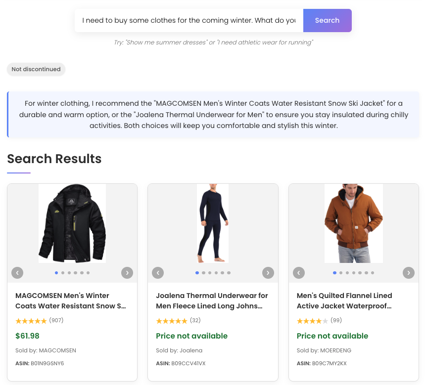
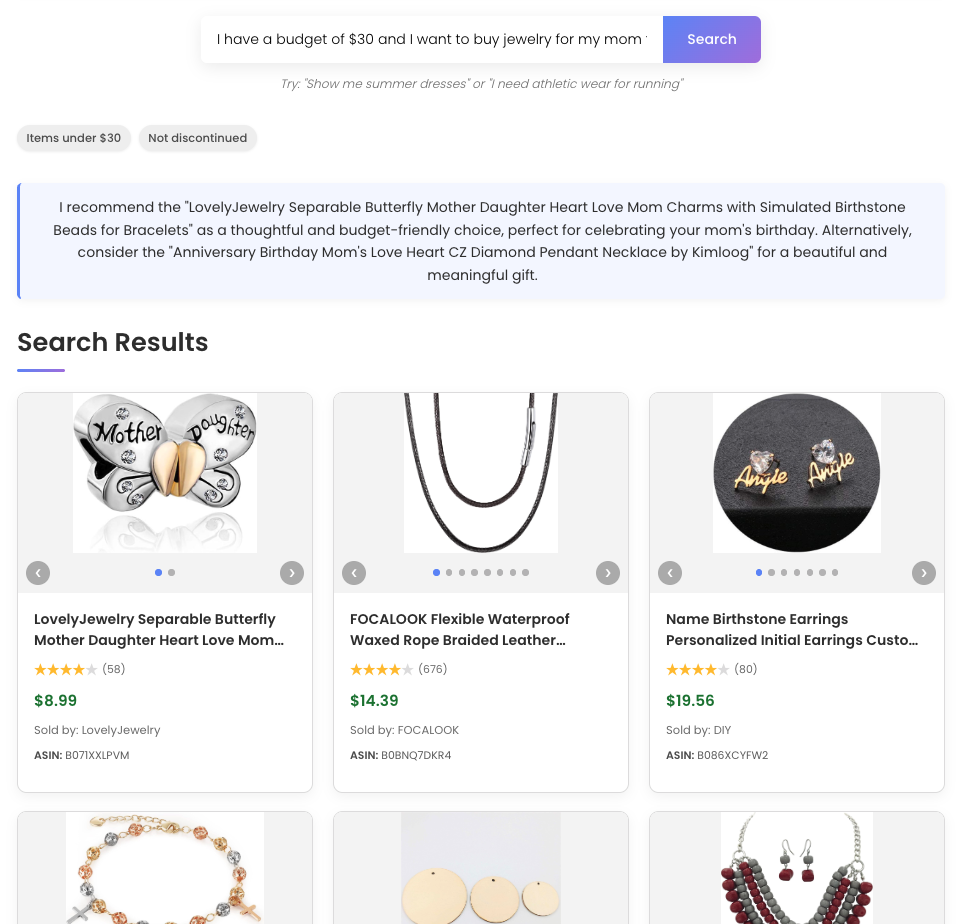
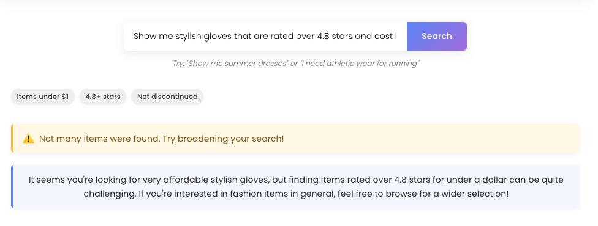
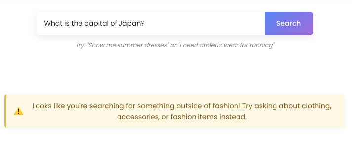
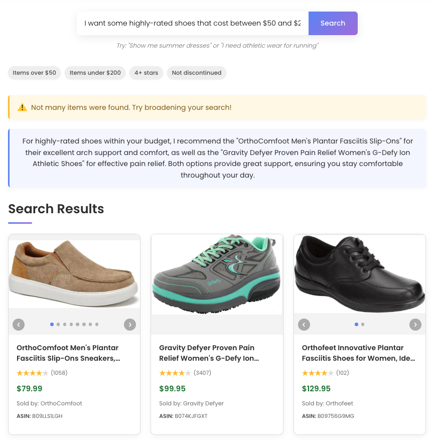

# Fashion Search

Fashion Search is a semantic search API for fashion products, built with FastAPI, OpenAI, and Supabase. Fashion Search allows users to search across an e-commerce store's fashion line using natural language queries. The system combines vector embeddings, sophisticated filtering, and intelligent ranking to deliver highly relevant results.

## Key Features

- **Semantic Search**: Understands natural language queries through OpenAI embeddings
- **Smart Filtering**: Automatically extracts filter criteria from natural language
- **Fashion-Focused Query Detection**: Automatically identifies and politely declines non-fashion queries, ensuring all responses remain relevant
- **Multi-factor Ranking**: Combines semantic similarity, ratings, and popularity
- **AI Recommendations**: Generates natural language recommendations for search results

# Setup Guide
This guide will walk you through setting up and deploying a local instance of the Fashion Search API

## Prerequisites

- Python 3.11 or Higher

## Set Up Your OpenAI Account

1. **Create an OpenAI Account** at [https://platform.openai.com/signup](https://platform.openai.com/signup) if you don't have one already.
   
   
2. **Configure Your Payment Method** with OpenAI, as completing the steps below will incur charges to your OpenAI account
   - Go to [https://platform.openai.com/settings/organization/billing/overview](https://platform.openai.com/settings/organization/billing/overview) 
   - Click "Add payment details" and enter your payment information

3. **Generate Your OpenAI API Key**:
   - Go to [https://platform.openai.com/api-keys](https://platform.openai.com/api-keys)
   - Click "Create new secret key"
   - Name your key (e.g., "Fashion Search API Key")
   - Leave the other settings in their default mode
   - Copy the key and paste it into the [.env file in the root of this project](.env). 
   - Your .env file should look like the following example:
      ```bash
      OPENAI_API_KEY="sk-**************..."
      SUPABASE_PROJECT_URL=""
      SUPABASE_KEY=""
      ```

## Set Up Your Supabase Project

1. **Create a Supabase Account** at [https://supabase.com/dashboard/sign-up](https://supabase.com/dashboard/sign-up) if you don't have one already.
   - Note that Supabase has a free usage plan to allow you to store up to 500 MB of data on their platform. This will be sufficient for Fashion Search.

2. **Create a New Project**:
   - Log in to the Supabase Dashboard
   - At the top of the browser, click your current Project name and select "New project"
   - Enter the name for your project (e.g., "fashion-search-project")
   - Choose a database password (save it securely)
   - Select a region closest to your users
   - Click "Create new project"

3. **Retrieve Your Supabase Project URL and API Key**:
   - Click on Project Settings in the bottom of the left menu
   - Click on Data API under the CONFIGURATION section on the left menu
   - Copy the "Project URL" (labeled as `URL`). It will look like ```https://{long_string_of_random_letters}.supabase.co```
   - Paste the Project URL in the [.env file in the root of this project](.env). 
   - Reveal and copy the "service_role" API key 
   - Paste the service_role API key in the [.env file in the root of this project](.env)
   - Your .env file should now look like the following example:
      ```bash
      OPENAI_API_KEY="sk-..."
      SUPABASE_URL="https://{long_string_of_random_letters}.supabase.co"
      SUPABASE_KEY="ey..."
      ```


4. **Set Up Your Supabase Environment**:
   - Copy the contents of [the supabase_setup.sql file](./scripts/supabase_setup.sql)
   - Open the SQL Editor in your project, paste the entire file's contents, and run the query. This will create the necessary extension, tables, indexes, and functions for Fashion Search

## Set Up Your Python Environment

   1. **Create and Activate a Virtual Environment**:
      
      Navigate to the root directory of this project, and run the following commands:
      ```bash
      # Create a virtual environment
      python -m venv venv
    
      # Activate the virtual environment

      # On Windows:
      venv\Scripts\activate
    
      # On macOS/Linux:
      source venv/bin/activate
      ```
   2. **Install Dependencies**:
      ```bash
      # Install all required packages
      pip install -r requirements.txt
      ```
   3. **Change to the Scripts Directory**:
       ```bash
       cd scripts
       ```

## Load Data Into Supabase

You have two methods to populate your database:
   - **Option A**: Upload the Included Embedded Sample Dataset (Recommended)
     - This sample dataset contains 3000 products from the [original dataset](https://huggingface.co/datasets/McAuley-Lab/Amazon-Reviews-2023/blob/main/raw/meta_categories/meta_Amazon_Fashion.jsonl), including embeddings for each product 
     - This will cost nothing to upload the dataset to Supabase, as long as you have 150 MB of database size available in your free usage plan
   - **Option B**: Process and Embed Data from Scratch
     - Load the [original dataset](https://huggingface.co/datasets/McAuley-Lab/Amazon-Reviews-2023/blob/main/raw/meta_categories/meta_Amazon_Fashion.jsonl) directly from the Hugging Face Hub
     - This will cost about $0.003 to process and embed each fashion product
   
**Option A: Upload the Included Embedded Sample Dataset**
   - Execute the upload_dataset_to_supabase.py script, specifying the local sample dataset as the input file. Use LIMIT to specify the maximum number of fashion products you want to process.
      ```bash
      python upload_dataset_to_supabase.py --input-path "data/amazon_fashion_sample" --limit LIMIT
      ```

**Option B: Process and Embed Data from Scratch**
   - Execute the upload_dataset_to_supabase.py script with a --generate-embeddings flag. Use LIMIT to specify the maximum number of fashion products you want to process.
   ```bash
   python upload_dataset_to_supabase.py --generate-embeddings --limit LIMIT
   ```
       
   This Will:
   - Load the Amazon Fashion dataset from Hugging Face
   - Generate embeddings using OpenAI's API
   - Upload the products and embeddings to your Supabase database

## Running the API Server

1. **Change Directory into /app**:
   ```bash
   cd ../app
   ```
2. **Start the FastAPI Server**:
   ```bash
   # From the project root directory
   uvicorn main:app --reload
   ```

   By default, the server will run on port 8000. If that port is already in use, 
   you can specify a different port:
   
   ```bash
   uvicorn main:app --reload --port 8080
   ```

4. **Access the API**:
   - The API will be available at `http://127.0.0.1:8000` (or your custom port)

   **Test the API**:

   **For macOS/Linux:**
   ```bash
   # Using curl on macOS/Linux
   curl -X POST http://127.0.0.1:8000/search \
     -H "Content-Type: application/json" \
     -d '{"prompt": "Find me a stylish winter coat under $100"}'
   ```
   
   **For Windows PowerShell:**
   ```powershell
   # Using curl on Windows PowerShell
   curl -X POST http://127.0.0.1:8000/search `
     -H "Content-Type: application/json" `
     -d '{\"prompt\": \"Find a stylish winter coat under $100\"}'
   ```

5. **(Optional) Deploy a Local Frontend**: Instructions for setting up an optional demo frontend interface are included at the end of this README. This lightweight interface allows you to visualize search results and test the Fashion Search API's capabilities through a simple UI rather than raw API responses.

# Sample Usage

### Seasonal Shopping

**Prompt:** "I need to buy some clothes for the coming winter. What do you suggest?"
   


---

### Look for Gifts on a Budget

**Prompt:** "I have a budget of $30 and I want to buy jewelry for my mom for her birthday"
   


---

### Search For Products Which Don't Exist

**Prompt:** "Show me stylish gloves that are rated over 4.8 stars and cost less than a dollar"



---

### Submit a Prompt That is Unrelated to Fashion

**Prompt:** "What is the capital of Japan?"



---

### Use Prompt with Many Filters

**Prompt:** "I want some highly-rated shoes that cost between $50 and $200"




# Key Decisions

## Vector Storage - PGVector
PGVector was selected for Fashion Search due to its unified architecture that allows users to store metadata and embeddings in a single PostgreSQL database, simplifying development and operations. Since the provided dataset follows a structured schema with relational elements that would naturally be stored in SQL tables, extending the same database to handle vector embeddings with PGVector provides significant advantages. 

Using a standalone vector database to store the vector embeddings from a standard relational database introduces database synchronization issues and significantly increases operational complexity. Storing all product data and embeddings in a single database such as PostgreSQL with PGVector allows for a single point of management for all product data and embeddings. 

While dedicated vector databases such as Pinecone offer great scalability and higher performance than PGVector with very large datasets, these features are simply not necessary for Fashion Search's scale. The additional operational complexity and cost of maintaining separate systems for structured data and associated vector embeddings would outweigh the potential performance benefits given the current requirements. PGVector's HNSW indexing provides more-than-sufficient query performance for our database while maintaining the simplicity of a single-database architecture.

## Similarity Metrics - Cosine Distance
Cosine similarity excels at capturing underlying relationships between embeddings, making it ideal for semantic search applications. Unlike Euclidean distance, which is influenced by vector magnitude, cosine similarity focuses purely on directional alignment between vectors.

This distinction is crucial when comparing fashion concepts. Consider the queries "sleek black dress" and "elegant black gown" - while using different terminology, they express similar fashion intent. Cosine similarity effectively recognizes this semantic overlap, whereas distance-based metrics might miss these connections due to differences in embedding magnitude.

Fashion Search prioritizes understanding underlying user intentions rather than exact keyword matching. A shopper searching for "beach attire" should find relevant swimwear and sundresses even when product descriptions use terms like "resort wear" or "summer collection." Cosine similarity's direction-focused approach enables this semantic connection, helping users discover relevant products regardless of specific terminology used in product descriptions or search queries. 

## Model Selection
The Fashion Search API leverages two models across both the data pipeline and the prompting system: gpt-4o-mini for captioning and recommendations, and text-embedding-3-small for embedding. Both models were selected for their remarkable cost effectiveness with near-peak performance across other chat and embedding models. Experiments were performed using different models instead of the selected two, such as gpt-4.5-preview-2025-02-27. However, no other models came close to delivering the value per dollar that the selected two models provided. This is especially crucial for an e-commerce platform like Fashion Search, as it would receive high traffic, thus yielding significant cost. The current model selection allows for high-growth in the future, without an unmanageable cost burden.

# Tradeoffs

## Embedding Strategy - Image Captioning with Text Embedding
The decision to generate and embed image captions alongside product text was a tradeoff between cost optimization and search quality. While this approach increases data ingestion costs by about 40%, it substantially improves semantic search quality.

Many fashion products in the dataset contain minimal textual information, making images the primary source of product details. Consider product B001GCGX9I, which includes only the sparse title "HB-020-3 Blk PU Shoulder Purse/Skull." Without image analysis, the embedding would lack critical semantic information about the product's appearance, style, and characteristics.

By incorporating AI-generated captions of product images, the system creates richer, more comprehensive embeddings that capture visual attributes like color, pattern, style, and design elements. This hybrid approach significantly improves search relevance while maintaining reasonable processing costs.

## Filter Extraction - Natural Language to Structured Constraints
Fashion Search streamlines user experience by automatically extracting structured filters directly from natural language queries. Using structured outputs from gpt-4o-mini, the system identifies filtering intentions embedded within conversational search prompts, translating them into precise database queries. This allows users to simply type queries like "stylish dresses under $75 with at least 4-star ratings" and receive appropriately filtered results immediately.

While this approach increases API costs by approximately 30% compared to basic semantic search, the investment significantly enhances user satisfaction, which would drive conversion in a real-world scenario.


# (Optional) Frontend Deployment

Deploy a minimal frontend to interact with the Fashion Search API

## Prerequisites

- Node.js: Version 16.x or higher
- npm: Package manager for JavaScript
- Running API: Your Fashion Search API must be running locally (default: http://localhost:8000)
- Web Browser: Modern browser like Chrome, Firefox, Safari, or Edge

## Setup Instructions

1. **Navigate to the frontend directory**:

   ```bash
   cd extras/frontend
   ```

2. **Install dependencies**:

   ```bash
   npm install
   ```

3. **Configure API connection** (optional):

   If your API is not running on its default port 8000, edit [App.js](extras/frontend/src/App.js) and replace ```http://localhost:8000``` with ```'http://localhost:YOUR_PORT```.

4. **Start the development server**:

   ```bash
   npm run dev
   ```

5. **Access the frontend**:

   Once the server starts, you'll see a URL in your terminal (typically http://localhost:3000).
   Open that URL in your web browser.